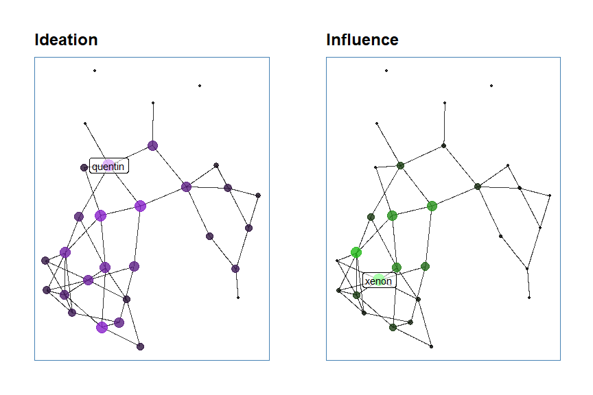
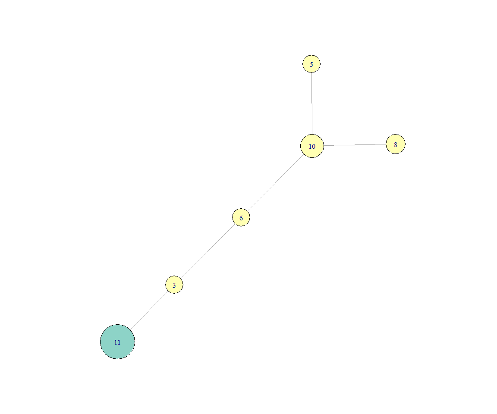

Team Rocket
================

### Libraries

``` r
library(magrittr)
library(igraph)
library(knitr)
library(hrgraphsign)
```

### Import Data

``` r
nodes <- readxl::read_excel("example/nodes.xlsx")
edges <- readxl::read_excel("example/edges.xlsx")
```

### Create Graph

``` r
example_graph <- edges %>% 
  to_undirected_edges("FromID", "ToID") %>% 
  graph_from_data_frame(directed = FALSE, vertices = nodes)
```

### Set Weights

``` r
E(example_graph)$weights <- E(example_graph)$edge_count
```

### Ideation Signature

``` r
V(example_graph)$ideation <- ideation_signature(example_graph)
```

### Display top 10

``` r
knitr::kable(get_top_by_column(example_graph, column = "ideation", n = 10))
```

|     |  ideation | name | firstName | lastName | title | department  | employmentYear |
|:----|----------:|:-----|:----------|:---------|:------|:------------|---------------:|
| 11  | 0.7200000 | 11   | klaes     | klurig   | NA    | Engineering |           2019 |
| 18  | 0.7200000 | 18   | rejdun    | rasande  | NA    | Engineering |           2018 |
| 10  | 0.6666667 | 10   | jenny     | jungola  | NA    | Sales       |           2019 |
| 16  | 0.6666667 | 16   | patrik    | park     | NA    | Engineering |           2019 |
| 25  | 0.6666667 | 25   | yngve     | ylle     | NA    | Marketing   |           2011 |
| 22  | 0.6641667 | 22   | vira      | vonka    | NA    | Marketing   |           2014 |
| 28  | 0.6463889 | 28   | ängbert   | ärlig    | NA    | Marketing   |           2011 |
| 8   | 0.6250000 | 8    | hans      | hurtig   | NA    | Sales       |           2017 |
| 13  | 0.6250000 | 13   | martin    | mustig   | NA    | Engineering |           2017 |
| 19  | 0.6250000 | 19   | sara      | sommar   | NA    | Engineering |           2010 |

### Plot graph

``` r
plot_graph(example_graph, 
           edge_width_by = "edge_count", 
           vertex_color_by = "department",
           vertex_size_by = "ideation")
```

<!-- -->

### Plot friends\_friends

``` r
plot_graph(friends_friends(example_graph, 6, 2),
           edge_width_by = "edge_count", 
           vertex_color_by = "department",
           vertex_size_by = "ideation")
```

<!-- -->
