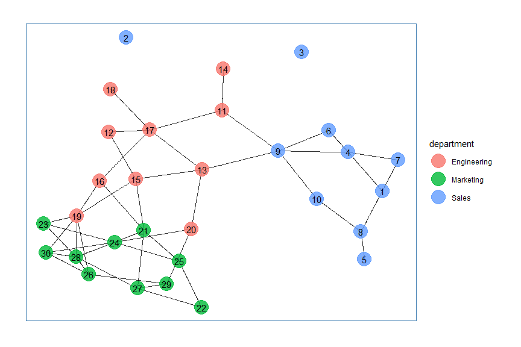

# hrgraphsign

    Simplifies analysis of hr-graph data based on a number of signatures
    from this article: https://hbr.org/2018/11/better-people-analytics

## Installation

    devtools::install_github("mrtnnrdlnd/hrgraphsign")

## Example

### Import Data

``` r
nodes <- readxl::read_excel("example/nodes.xlsx")
knitr::kable(nodes %>% head(5))
```

|  ID | firstName | lastName | title | department | employmentYear |
|----:|:----------|:---------|:------|:-----------|---------------:|
|   1 | adolf     | albano   | NA    | Sales      |           2014 |
|   2 | benny     | bop      | NA    | Sales      |           2012 |
|   3 | cristine  | cristal  | NA    | Sales      |           2017 |
|   4 | dan       | damp     | NA    | Sales      |           2015 |
|   5 | egil      | efraheim | NA    | Sales      |           2017 |

``` r
edges <- readxl::read_excel("example/edges.xlsx")
knitr::kable(edges %>% head(5))
```

| date       | FromID | ToID | medium  |  …5 |  …6 |
|:-----------|-------:|-----:|:--------|----:|----:|
| 2021-04-19 |      4 |    6 | email   |   1 |  10 |
| 2021-04-20 |      5 |    8 | meeting |   1 |  10 |
| 2021-04-21 |      6 |    6 | meeting |   1 |  10 |
| 2021-04-22 |      1 |    8 | email   |   1 |  10 |
| 2021-04-23 |      6 |    4 | email   |   1 |  10 |

### Create Graph

``` r
example_graph <- edges %>% 
  dplyr::select(FromID, ToID) %>%
  igraph::graph_from_data_frame(directed = FALSE, vertices = nodes) %>% 
  hrgraphsign::aggregate_edges()
```

### Ideation Signature

Predicts, according to the article, which employees will come up with
good ideas

``` r
igraph::V(example_graph)$ideation <- hrgraphsign::ideation_signature(example_graph)
```

### Influence Signature

Predicts, according to the article, Which employees will change others’
behavior

``` r
igraph::V(example_graph)$influence <- hrgraphsign::influence_signature(example_graph)
```

### Display top 10

``` r
knitr::kable(hrgraphsign::get_top_by_column(example_graph, column = "ideation", n = 10))
```

|     |  ideation | name | firstName | lastName | title | department  | employmentYear | influence |
|:----|----------:|:-----|:----------|:---------|:------|:------------|---------------:|----------:|
| 17  | 10.000000 | 17   | quentin   | quitter  | NA    | Engineering |           2018 |  3.947061 |
| 21  |  6.611570 | 21   | urban     | undilat  | NA    | Marketing   |           2017 |  6.066019 |
| 13  |  6.400000 | 13   | martin    | mustig   | NA    | Engineering |           2017 |  7.768433 |
| 15  |  6.400000 | 15   | olof      | otur     | NA    | Engineering |           2018 |  6.668358 |
| 27  |  6.400000 | 27   | åvald     | åker     | NA    | Marketing   |           2015 |  2.817219 |
| 24  |  5.874853 | 24   | xenon     | xor      | NA    | Marketing   |           2012 |  7.259042 |
| 9   |  5.507745 | 9    | ior       | icke     | NA    | Sales       |           2013 |  3.738459 |
| 19  |  4.750515 | 19   | sara      | sommar   | NA    | Engineering |           2010 | 10.000000 |
| 8   |  4.000000 | 8    | hans      | hurtig   | NA    | Sales       |           2017 |  1.046659 |
| 11  |  4.000000 | 11   | klaes     | klurig   | NA    | Engineering |           2019 |  1.592476 |

### Plot graph

``` r
set.seed(5)
layout1 <- igraph::layout.fruchterman.reingold(example_graph)
par(mfrow = c(1,2))
plot(example_graph,
     edge.width = igraph::E(example_graph)$weights,
     vertex.color = hrgraphsign::vertices_colors(example_graph, attribute = "department"),
     vertex.size = hrgraphsign::vertices_sizes(example_graph, attribute = "ideation"),
     main = "Ideation",
     layout = layout1
     )
plot(example_graph,
     edge.width = igraph::E(example_graph)$weights,
     vertex.color = hrgraphsign::vertices_colors(example_graph, attribute = "department"),
     vertex.size = hrgraphsign::vertices_sizes(example_graph, attribute = "influence"),
     main = "Influence",
     layout = layout1
)
```

<!-- -->

### Plot friends\_friends

``` r
par(mfrow = c(1,2))
subgraph <- hrgraphsign::friends_friends(example_graph, 13, 2)
set.seed(10)
layout2 <- igraph::layout.fruchterman.reingold(subgraph)
  plot(subgraph,
       edge.width = igraph::E(example_graph)$weights,
       vertex.color = hrgraphsign::vertices_colors(subgraph, attribute = "department"),
       vertex.size = hrgraphsign::vertices_sizes(subgraph, attribute = "ideation"),
       main = "Ideation",
       layout = layout2
  )
  plot(subgraph,
       edge.width = igraph::E(example_graph)$weights,
       vertex.color = hrgraphsign::vertices_colors(subgraph, attribute = "department"),
       vertex.size = hrgraphsign::vertices_sizes(subgraph, attribute = "influence"),
       main = "Influence",
       layout = layout2
  )
```

<!-- -->
