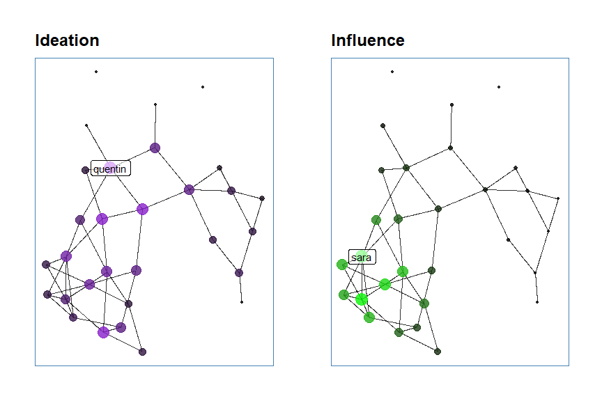

# hrgraphsign

    Simplifies analysis of hr-graph data based on a number of signatures
    from this article: https://hbr.org/2018/11/better-people-analytics

## Installation

    devtools::install_github("mrtnnrdlnd/hrgraphsign")

## Example

### Import Data

``` r
nodes <- readxl::read_excel("example/nodes.xlsx")
edges <- readxl::read_excel("example/edges.xlsx")
```

### Create Graph

``` r
example_graph <- edges %>% 
  hrgraphsign::to_undirected_edges("FromID", "ToID") %>% 
  igraph::graph_from_data_frame(directed = FALSE, vertices = nodes)
```

### Set Weights

``` r
igraph::E(example_graph)$weights <- igraph::E(example_graph)$edge_count
```

### Ideation Signature

``` r
igraph::V(example_graph)$ideation <- hrgraphsign::ideation_signature(example_graph)
```

### Display top 10

``` r
knitr::kable(hrgraphsign::get_top_by_column(example_graph, column = "ideation", n = 10))
```

|     |  ideation | name | firstName | lastName | title | department  | employmentYear |
|:----|----------:|:-----|:----------|:---------|:------|:------------|---------------:|
| 11  | 10.000000 | 11   | klaes     | klurig   | NA    | Engineering |           2019 |
| 18  | 10.000000 | 18   | rejdun    | rasande  | NA    | Engineering |           2018 |
| 10  |  6.000000 | 10   | jenny     | jungola  | NA    | Sales       |           2019 |
| 16  |  6.000000 | 16   | patrik    | park     | NA    | Engineering |           2019 |
| 25  |  6.000000 | 25   | yngve     | ylle     | NA    | Marketing   |           2011 |
| 22  |  5.889571 | 22   | vira      | vonka    | NA    | Marketing   |           2014 |
| 28  |  5.207957 | 28   | ängbert   | ärlig    | NA    | Marketing   |           2011 |
| 8   |  4.571429 | 8    | hans      | hurtig   | NA    | Sales       |           2017 |
| 13  |  4.571429 | 13   | martin    | mustig   | NA    | Engineering |           2017 |
| 19  |  4.571429 | 19   | sara      | sommar   | NA    | Engineering |           2010 |

### Plot graph

``` r
example_graph %>% 
  hrgraphsign::plot_graph(edge_width_by = "edge_count",
                          vertex_color_by = "department",
                          vertex_size_by = "ideation")
```

<!-- -->

### Plot friends\_friends

``` r
hrgraphsign::friends_friends(example_graph, 11, 3) %>% 
  hrgraphsign::plot_graph(edge_width_by = "edge_count",
                          vertex_color_by = "department",
                          vertex_size_by = "ideation")
```

<!-- -->
