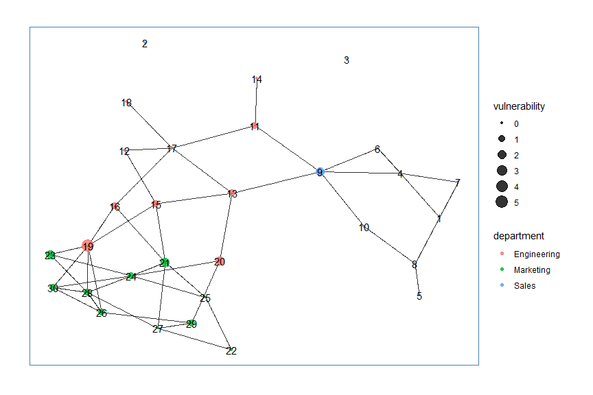
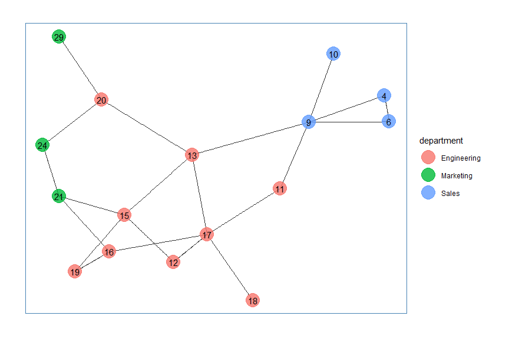

# hrgraphsign

    Simplifies analysis of hr-graph data based on the six signatures
    from this article: https://hbr.org/2018/11/better-people-analytics

## Installation

    devtools::install_github("mrtnnrdlnd/hrgraphsign")

## Background

There are measures of employees performance which can’t be measured in
isolation. Six of these measures are mentioned in the article:

> **Better People Analytics** Measure who they know, not just who they
> are. **by Paul Leonardi and Noshir Contractor**

This package is an attempt to make these six measures a little easier to
use in practice. The measures are referred to as signatures in the
article and so they will be here. They are, in order of appearance:

1.  **Ideation Signature** - Individual level measure
2.  **Influence Signature** - Individual level measure
3.  **Efficiency Signature** - Team level measure
4.  **innovation Signature** - Team level measure
5.  **Silo Signature** - Team / Organizational level measure
6.  **Vulnerability Signature** Organizational level measure

## The Signatures By Example

Before getting to the actual signatures we load some example data and
create a connected network from it

### Example Data

``` r
# nodes will be representing the employees
nodes <- readxl::read_excel("example/nodes.xlsx")
# Look at data
knitr::kable(nodes %>% head(5))
```

|  ID | firstName | lastName | title | department | employmentYear |
|----:|:----------|:---------|:------|:-----------|---------------:|
|   1 | adolf     | albano   | NA    | Sales      |           2014 |
|   2 | benny     | bop      | NA    | Sales      |           2012 |
|   3 | cristine  | cristal  | NA    | Sales      |           2017 |
|   4 | dan       | damp     | NA    | Sales      |           2015 |
|   5 | egil      | efraheim | NA    | Sales      |           2017 |

``` r
# edges will be representing the relations between the employees
edges <- readxl::read_excel("example/edges.xlsx")
# Look at data
edges %>% head(5) %>% 
  dplyr::select(date, FromID, ToID, medium) %>% 
  knitr::kable()
```

| date       | FromID | ToID | medium  |
|:-----------|-------:|-----:|:--------|
| 2021-04-19 |      4 |    6 | email   |
| 2021-04-20 |      5 |    8 | meeting |
| 2021-04-21 |      6 |    6 | meeting |
| 2021-04-22 |      1 |    8 | email   |
| 2021-04-23 |      6 |    4 | email   |

### Create Graph

``` r
example_graph <- edges %>% 
  dplyr::select(FromID, ToID, everything()) %>%
  igraph::graph_from_data_frame(directed = FALSE, vertices = nodes) %>% 
  hrgraphsign::aggregate_edges()
```

### Individual Level

#### Ideation Signature

Predicts, according to the article, which employees will come up with
good ideas.

The ideation signature is measured by having a low value of something
called **Burt’s constraint**, named after Ronald Stuart Burt. It looks
at how widespread connections and how much connections to different
groups a person has.

``` r
# Get ideation measure
igraph::V(example_graph)$ideation <- hrgraphsign::ideation_signature(example_graph)
# Display Top 3 For Ideation
hrgraphsign::get_top_by_column(example_graph, column = "ideation", n = 3) %>% 
  dplyr::select(firstName, lastName, ideation) %>% 
  knitr::kable()
```

|     | firstName | lastName | ideation |
|:----|:----------|:---------|---------:|
| 17  | quentin   | quitter  |      4.5 |
| 13  | martin    | mustig   |      4.0 |
| 15  | olof      | otur     |      4.0 |

#### Influence Signature

Predicts, according to the article, Which employees will change others’
behavior

Measures how connected connections a person has.

Note: Implementation is vague

``` r
# Get influence measure
igraph::V(example_graph)$influence <- hrgraphsign::influence_signature(example_graph)
# Display Top 3 For Influence
hrgraphsign::get_top_by_column(example_graph, column = "influence", n = 3) %>% 
  dplyr::select(firstName, lastName, influence, ideation) %>% 
  knitr::kable()
```

|     | firstName | lastName | influence | ideation |
|:----|:----------|:---------|----------:|---------:|
| 24  | xenon     | xor      |  0.113442 | 3.360392 |
| 19  | sara      | sommar   |  0.085714 | 3.482800 |
| 13  | martin    | mustig   |  0.068187 | 4.000000 |

#### Comparison

``` r
set.seed(5)
ideation_plot <- ggraph(example_graph, layout = 'fr') + 
  geom_edge_link(show.legend = FALSE, alpha = 0.8) + 
  geom_node_point(aes(colour = ideation, size = ideation), alpha = 0.8, show.legend = FALSE) + 
  theme_graph(foreground = 'steelblue', fg_text_colour = 'white') + 
  scale_colour_gradient(low = "black", high = "purple") +
  ggtitle("Ideation") + 
  geom_node_label(aes(label = firstName, filter = ideation == max(ideation)), color = 'black', 
                 size = 4, alpha = 0.6)

set.seed(5)
influence_plot <- ggraph(example_graph, layout = 'fr') + 
  geom_edge_link(show.legend = FALSE, alpha = 0.8) + 
  geom_node_point(aes(colour = influence, size = influence), alpha = 0.8, show.legend = FALSE) +
  theme_graph(foreground = 'steelblue', fg_text_colour = 'white') +
  scale_colour_gradient(low = "black", high = "green") +
  ggtitle("Influence") +
  geom_node_label(aes(label = firstName, filter = influence == max(influence)), color = 'black', 
                 size = 4, alpha = 0.6)

ideation_plot + influence_plot
```

<!-- -->

### Team Level

``` r
# Create subgraph for teams to measure
teams <- c("Engineering", "Marketing", "Sales")

engineering_team <- example_graph %>%
  igraph::induced_subgraph(., igraph::V(.)[igraph::V(.)$department == "Engineering"])
marketing_team <- example_graph %>%
  igraph::induced_subgraph(., igraph::V(.)[igraph::V(.)$department == "Marketing"])
sales_team <- example_graph %>%
  igraph::induced_subgraph(., igraph::V(.)[igraph::V(.)$department == "Sales"])
```

#### Preview

This is just to get a feel for the graph and the teams/departments.
Subsequent measures are done on this team configuration.

``` r
set.seed(5)
ggraph(example_graph, layout = 'fr') + 
    geom_edge_link(show.legend = FALSE, alpha = 0.8) + 
    geom_node_point(aes(colour = department), size = 8, alpha = 0.8, show.legend = TRUE) + 
    theme_graph(foreground = 'steelblue', fg_text_colour = 'white') +
    geom_node_text(aes(label = name))
```

<!-- -->

#### Efficiency Signature

Predicts, according to the article, Which teams will complete projects
on time.

The efficiency signature is a combination of a team with **high
density**, and at the same time have **high external range** which means
having members that are well connected to different sources outside the
team.

``` r
# Get measures
efficiency <- c(
  hrgraphsign::efficiency_signature(example_graph, engineering_team),
  hrgraphsign::efficiency_signature(example_graph, marketing_team),
  hrgraphsign::efficiency_signature(example_graph, sales_team)
)

knitr::kable(data.frame(teams, efficiency))
```

| teams       | efficiency |
|:------------|-----------:|
| Engineering |  0.4888889 |
| Marketing   |  0.3555556 |
| Sales       |  0.2222222 |

#### Innovation Signature

Predicts, according to the article, Which teams will innovate
effectively.

The innovation signature is a combination of a team with **low density**
and at the same time have **high external range** or **wide, diverse
connections**.

``` r
# Get measures
innovation <- c(
  hrgraphsign::innovation_signature(example_graph, engineering_team),
  hrgraphsign::innovation_signature(example_graph, marketing_team),
  hrgraphsign::innovation_signature(example_graph, sales_team)
)

knitr::kable(data.frame(teams, efficiency, innovation))
```

| teams       | efficiency | innovation |
|:------------|-----------:|-----------:|
| Engineering |  0.4888889 |   4.533333 |
| Marketing   |  0.3555556 |   2.577778 |
| Sales       |  0.2222222 |   7.777778 |

#### Silo Signature (Team)

To measure how siloed a team is you take the quotient of internal and
external edges.

``` r
# Get measures
silo <- c(
  hrgraphsign::silo_quotient(example_graph, engineering_team),
  hrgraphsign::silo_quotient(example_graph, marketing_team),
  hrgraphsign::silo_quotient(example_graph, sales_team)
)

knitr::kable(data.frame(teams, silo, efficiency, innovation))
```

| teams       |      silo | efficiency | innovation |
|:------------|----------:|-----------:|-----------:|
| Engineering | 0.5789474 |  0.4888889 |   4.533333 |
| Marketing   | 1.6000000 |  0.3555556 |   2.577778 |
| Sales       | 5.0000000 |  0.2222222 |   7.777778 |

### Organizational Level

#### Silo Signature (Organization)

Predicts, according to article, Whether an organization is siloed.

The measure of the organization at large is based on the **modularity**
of the graph.

``` r
example_graph %>% hrgraphsign::silo_signature(., membership = department)
```

    ## [1] 0.4354912

#### Vulnerability Signature

Predicts, according to article, Which employees the organization can’t
afford to lose.

This measure of vulnerability counts how many connections a vertex has
to vertices outside the team.

``` r
# Get measure
igraph::V(example_graph)$vulnerability <- example_graph %>% 
  hrgraphsign::vulnerability_signature(., membership = department)

# Visualize
set.seed(5)
ggraph(example_graph, layout = 'fr') + 
    geom_edge_link(show.legend = FALSE, alpha = 0.8) + 
    geom_node_point(aes(colour = department, size = vulnerability), alpha = 0.8, show.legend = TRUE) +
    scale_colour_discrete() +
    theme_graph(foreground = 'steelblue', fg_text_colour = 'white') +
    geom_node_text(aes(label = name))
```

<!-- -->

### Misc

#### Color by Clustering Algorithm

``` r
# Get measure
igraph::V(example_graph)$cluster <- igraph::cluster_fast_greedy(igraph::as.undirected(example_graph))$membership

igraph::V(example_graph)$vulnerability <- example_graph %>% 
  hrgraphsign::vulnerability_signature(., membership = cluster)

# Visualize
set.seed(5)
ggraph(example_graph, layout = 'fr') + 
    geom_edge_link(show.legend = FALSE, alpha = 0.8) + 
    geom_node_point(aes(color = factor(cluster), size = vulnerability), alpha = 0.8, show.legend = TRUE) +
    scale_color_discrete() +
    theme_graph(foreground = 'steelblue', fg_text_colour = 'white') +
    geom_node_text(aes(label = name))
```

<!-- -->

#### Plot friends\_friends

``` r
# Make a subgraph of vertice 13 and neighbors 2 steps away
subgraph <- hrgraphsign::friends_friends(example_graph, vertices = 13, n_steps = 2)
set.seed(5)
ggraph(subgraph, layout = 'fr') + 
    geom_edge_link(show.legend = FALSE, alpha = 0.8) + 
    geom_node_point(aes(colour = department), size = 8, alpha = 0.8, show.legend = TRUE) + 
    theme_graph(foreground = 'steelblue', fg_text_colour = 'white') +
    geom_node_text(aes(label = name))
```

<!-- -->
